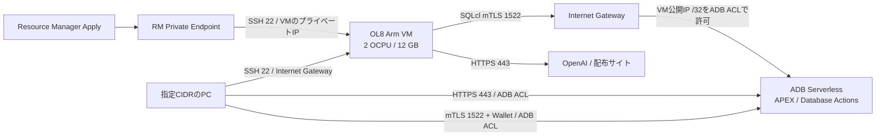

# OCI APEXlang 学習ラボ

[](https://cloud.oracle.com/resourcemanager/stacks/create?zipUrl=https://github.com/kazuitox/oci-apexlang-lab/archive/refs/tags/v1.5.1.zip)

APEXlangを学習・実験するための環境を、OCI Resource Managerから構築するTerraformテンプレートです。上のボタンから **v1.5.1** のスタック作成画面を開くか、配布ZIPをアップロードして開始できます。必要な値を入力し、Planで確認してからApplyしてください。

指定した接続元CIDRから、開発VMへSSH、ADBへSQLcl・APEX・Database Actionsで直接アクセスできます。VMとADB、ネットワークをOCIに配置します。Codex CLIの推論先はOpenAIのサービスです。**既定は有料構成で、大阪などホームリージョン以外でも利用できます。** Always Freeは入力フォームで選択できます。

## 構成

| 対象 | 作成する内容 |
| --- | --- |
| 開発VM | VM.Standard.A1.Flex / **2 OCPU / 12 GB** / Oracle Linux 8.10 aarch64 / 公開IPv4 |
| Boot Volume | 50 GB、Balanced（10 VPU/GB） |
| ADB | Autonomous Database Serverless、Transaction Processing。**既定は有料2 ECPU・20 GB**、LICENSE_INCLUDED、CPU/Storage自動拡張は無効。Always Free選択時は1 OCPU・20 GB。26ai（19cも選択可） |
| VCN | 既定10.60.0.0/16、VM用Public Subnet 10.60.0.0/24、RM用Private Subnet 10.60.1.0/24 |
| ネットワーク | Internet Gateway、Route Table、専用Security List、Resource Manager Private Endpoint |
| IAM（任意） | 対象VMだけを含むDynamic Group、当該ADBのWallet取得だけを許可するPolicy。作成APIはホームリージョンへ送信 |
| VMのツール | Oracle JDK 21 AArch64、SQLcl 26.2.2.233.1901、Codex CLI、Node.js 22、Git、Python 3.11、OCI SDK |
| VM構成処理 | Ansible Core 2.19.8をVM上で実行。タスク進捗とPLAY RECAPをRMのApplyログへ表示 |
| APEX初期設定 | 既定でAnsibleがDBユーザー・Workspace・APEX画面用ユーザーを `APEXLAB` で作成。初期パスワードはRMのADB ADMINと同じ |
| APEXスキル | Oracle公式 `oracle/skills` の `apex/apexlang` をopcの `~/.agents/skills/apexlang` に登録 |

ADB付属のAPEX/ORDSを使用します。別のDBサーバーやORDSサーバーは作成しません。VMはCLI用で、GUI/VNCサーバーは導入しません。



ADBは公開エンドポイントです。ADBのアクセス制御リスト（ACL）へ、入力した外部接続元CIDRと **VMの公開IPv4 /32** を設定します。VMからADBへの通信はInternet Gatewayを経由します。VMを置換して公開IPが変わった場合も、同じApplyでADB ACLを更新します。ADBアクセスの可否はVMのSecurity Listだけでなく、このADB側ACLでも制御します。

公開サブネットの同じルート表にInternet Gatewayと「All Services」宛てService Gatewayは併用できないため、Service Gatewayは作成しません。[Oracleの既知のネットワーク制約](https://docs.oracle.com/en-us/iaas/Content/Network/Reference/known_issues_for_networking.htm)

| 通信 | 許可 |
| --- | --- |
| RM Private Endpoint → VM | RM専用サブネットからVMへのTCP 22。Endpoint側の送信先はVMのプライベートIP /32のみ |
| 外部 → VM | 入力したIPv4 CIDRからのTCP 22のみ |
| 外部 → ADB | 入力したIPv4 CIDR。HTTPS 443およびmTLS 1522。DB接続にはWalletとDB認証も必要 |
| VM → ADB | TCP 1522の送信を許可。送信先は動的なADB公開エンドポイントに対応するため0.0.0.0/0、ADB側ACLはVM公開IP /32に限定。HTTPSは共通443ルールで許可 |
| VM → 外部 | TCP 80/443。OSパッケージ、ツール、GitHub、OCI API、OpenAIへの通信 |
| VM → OCIローカルサービス | 169.254.169.254へのDNS UDP/TCP 53、NTP UDP 123 |
| その他のVM着信 | Path MTU Discovery用ICMP Type 3 Code 4のみ、送信元を限定せず許可 |

Security Listはstatefulです。ADB用ポートをVMの着信ルールに追加する必要はありません。VCNのデフォルトSecurity Listはこのサブネットへ関連付けません。

## 料金モードと前提

**有償テナンシかどうかと、ADBをAlways Freeで作るかどうかは別の設定です。** テナンシの契約から自動判定せず、`use_always_free` で選択します。

| `use_always_free` | 配置リージョン | ADB設定 |
| --- | --- | --- |
| **false（既定）** | 大阪など、対象サービスが提供される購読済みリージョン | 有料、2 ECPU、20 GB、LICENSE_INCLUDED、自動拡張なし |
| true | ホームリージョンのみ | Always Free、1 OCPU、20 GB、自動拡張なし |

有料構成は通常のTransaction Processingの最小サイズを使用します。ホームリージョン以外ではVMとBoot Volumeも通常課金の対象です。[ADBのECPU・ストレージ最小値](https://docs.oracle.com/en-us/iaas/autonomous-database-serverless/doc/autonomous-compute-models.html)

VM・ADB・VCNは指定リージョンへ作成し、Dynamic GroupとPolicyの管理APIだけホームリージョンへ送ります。ホームリージョンはリージョン購読情報から自動取得します。[OCIのIAMとホームリージョン](https://docs.oracle.com/en-us/iaas/Content/Identity/Tasks/managingregions.htm)

### Always Freeを選ぶ場合

2026-09-20時点の[Oracle公式Always Free条件](https://docs.oracle.com/en-us/iaas/Content/FreeTier/freetier_topic-Always_Free_Resources.htm)では、A1の無料枠は月1,500 OCPU時間・9,000 GB時間です。このVMを31日間動かすと **1,488 OCPU時間・8,928 GB時間** です。他のA1 VMと使用量を合算するため、既存利用があれば別途確認してください。Boot Volumeもテナンシの無料Block Volume容量に合算されます。

- `use_always_free = true` の場合は**ホームリージョン**に作成してください。それ以外のリージョンではTerraformが停止します。有料構成ではこの制限は適用しません。
- Always Free ADBの空き枠、A1容量、50 GBのBoot Volume分の無料枠が必要です。枠不足時に有料ADBや別シェイプへ自動切り替えしません。
- A1 ComputeにはADBの `is_free_tier` に相当する課金停止スイッチがありません。テナンシ全体で無料枠内かどうかは、このスタックだけでは保証できません。
- Always Freeでは、アイドルVMの回収、ADBの未使用時停止・長期停止時の削除があり得ます。学習コードはGit等で別途保管してください。
- CodexのChatGPTプランまたはAPI利用はOCI無料枠に含まれません。

APEXlangには**APEX 26.1以降**が必要です。ADB上のAPEXバージョンをTerraformから任意に固定・更新することはできないため、作成後に付属のSQLで確認します。ADBのDBバージョン26aiとAPEXのバージョンは別です。[SQLclのAPEXlang前提条件](https://docs.oracle.com/en/database/oracle/sql-developer-command-line/26.1/sqcug/prerequisites-apexlang.html)

DBバージョンの提供状況は料金モード・リージョンで確認してください。26aiを選べない場合は、提供されている19cを選び、そのADBのAPEXが26.1以降であることを確認してください。[ADB作成時のバージョンとリージョン条件](https://docs.oracle.com/en-us/iaas/autonomous-database-serverless/doc/autonomous-provision.html)

SQLclはArm64 JDKでZIP版を実行します。Oracle Linux 8向けArm64のSQLcl配布も確認しています。Codexは公式インストーラーのLinux Arm64版を利用しますが、Oracle Linux 8を個別に認定したサポート表は確認できていません。ユーザー提供のOL8/A1のApplyログでツールのバージョン出力を確認し、Wallet修正後のデプロイ成功も報告されています。構築後のopcによるSQLcl起動で権限エラーが判明したため、1.4.5で修正しました。ユーザーはVM上のJARがroot:root・0640であることを確認し、権限変更後の起動・接続手順の成功を報告しています。[SQLcl配布](https://www.oracle.com/database/sqldeveloper/technologies/sqlcl/download/)、[Oracle JDK 21認定構成](https://www.oracle.com/java/technologies/javase/products-doc-jdk21certconfig.html)、[Codex CLI](https://learn.chatgpt.com/docs/codex/cli)

## Resource Managerでのデプロイ

1. 配置先リージョンを選び、既存のコンパートメントを用意します。大阪で有料構成を使用する場合は `ap-osaka-1`、`use_always_free = false` とします。Always Freeを選ぶ場合のみホームリージョンを使用します。
2. README冒頭の **Deploy to Oracle Cloud** ボタンをクリックします。手動でアップロードする場合は、リポジトリを取得して `python3 scripts/build_zip.py` を実行し、Resource Manager → スタック → スタックの作成 → ZIPアップロードで、`dist/apexlang-oci-resource-manager.zip` を選びます。
3. Terraformは **1.5.x** を選択します。この構成は1.5.7で検証しています。ボタンが参照するGitHubのタグZIPでは、`oci-apexlang-lab-1.5.1/` に `.tf` と `schema.yaml` があります。作業ディレクトリにはこれらのファイルがあるフォルダを指定します。`scripts/build_zip.py` で作成した配布ZIPではZIPのルートにあります。[Resource Manager対応バージョン](https://docs.oracle.com/en-us/iaas/Content/ResourceManager/Reference/terraformversions.htm)
4. 次の値を入力します。テナンシOCID・リージョンはResource Managerが設定します。
5. **Plan**で確認し、**Apply**します。ApplyログにAnsibleのTASKとPLAY RECAPが表示されます。ツール・Wallet・TCP接続検証の完了後にApplyが成功します（Wallet自動取得を無効にした場合はツール確認まで）。

### Folderを選択する場合

作業ディレクトリ `APEXlang` をそのまま選ぶと、ローカル検証で生成された `.terraform` が含まれ、Resource Managerが `An invalid .terraform directory was found in this folder` と表示する場合があります。`.gitignore` はResource Managerのフォルダアップロードには適用されません。

Folderを使う場合は、**配布用ZIPを空のフォルダへ展開し、その展開先を選択**してください。今回の配布用フォルダは `dist/apexlang-oci-resource-manager/` です。`.tf` と `schema.yaml` がこのフォルダの直下にあります。ソース変更後はZIPを再生成し、改めて空のフォルダへ展開してください。

`.terraform/` はローカル実行用キャッシュなのでアップロードしません。一方、`.terraform.lock.hcl` はプロバイダーのバージョン・チェックサムを固定する別のファイルで、配布物に含めています。

| 入力 | 指定内容 |
| --- | --- |
| コンパートメント | ネットワーク、VM、ADBを作成する既存コンパートメント |
| Always Free構成を使用する | **大阪で有料利用する場合は無効（false）**。有効時はホームリージョンのみ |
| 名前接頭辞（Prefix） | 既定 `apexlang`。ADBの自動名にも使用。複数スタックではIAM名の重複を避けるため別の値を指定。既存スタックの更新では維持 |
| 可用性ドメイン | A1の空き容量があるAD |
| イメージ | **Oracle提供の標準Oracle Linux 8.10 aarch64 / UEK7**。x86_64や有償Marketplaceイメージは選ばない |
| SSH公開鍵 | 例：`ssh-ed25519 AAAA...`。秘密鍵は入力しない |
| 許可CIDR | ご自宅・会社等のグローバルIPv4 CIDR。複数はカンマ区切り。例示の `203.0.113.10/32` は実際の接続元に置換 |
| ADB名を自動生成する | **既定は有効**。Prefixの英数字部分の先頭最大6文字＋8桁のランダム値で生成 |
| 固定データベース名 | 自動生成を無効にした場合のみ使用。**同一テナンシ・同一リージョン全体で一意**の名前。別コンパートメントのADBとも重複不可 |
| 共通の初期パスワード | ADMINとAPEXLABで共用。12〜30文字、大文字・小文字・数字を含む。二重引用符・制御文字・`admin`・`apexlab`は不可 |
| Wallet自動取得IAM | 通常は有効。Dynamic Group/Policy作成権限がない場合は無効にして手動配置 |
| APEX自動初期化 | 既定は有効。APEXLABのDBユーザー・Workspace・APEXユーザーを作成し、共通パスワードを設定。手動Walletの場合は無効にする |
| Codexバージョン | 既定 `latest`。必要なら公式配布の固定バージョン |
| Ansible再実行番号 | 既定 `1`。成功済みの同じ設定を再実行したいときに変更 |

接続元CIDRの入力は必須で、`0.0.0.0/0`、IPv6、不正なCIDRを拒否します。自宅等のグローバルIPが変わった場合はスタック変数を変更し、Plan/ApplyでSecurity ListとADB ACLを更新してください。

イメージのOCIDは選択した値に固定します。次回Apply時に「最新イメージ」が変わったという理由だけでVMが置換されることを防ぎます。フォームで候補が表示されない場合は、コンパートメントのイメージ参照権限と、そのリージョンのA1対応OL8イメージを確認してください。

### ADB名の自動生成と固定名

表示名と接続用の内部名を分けています。Prefixが `apexlang`、生成値が `3f82c901` の例：

| 用途 | 名前 |
| --- | --- |
| OCIコンソールの表示名 | **`APEXLANG-3F82C901`** |
| DB内部名・SQL接続 | `APEXLA3F82C901` |
| SQLclのサービス | `apexla3f82c901_low` |

DB内部名にはハイフンを使用できないため英数字のみとし、表示名にはPrefix全体とハイフンを使います。[OracleのDB命名条件](https://docs.oracle.com/en-us/iaas/autonomous-database-serverless/doc/autonomous-provision.html)

ランダム値は `random_id.adb_suffix` としてTerraform stateに保存します。通常のPlan/Applyで毎回生成し直すことはありません。同じPrefixでも新しいstateでは別の値が生成され、衝突の可能性を小さくします。値が必ず一意になる保証ではありません。stateを失うと同じ名前を再現できないため、復旧時も既存スタックのstateを維持してください。[HashiCorp Random Providerのstate保持仕様](https://registry.terraform.io/providers/hashicorp/random/latest/docs)

表示名は **`adb_display_name`**、内部名はResource Managerの出力 **`adb_database_name`**、SQLclの接続サービスは **`adb_low_service`** で確認できます。生成した名前をADB、VM内の設定、SQLclサービス名に共通で使用します。自動生成が有効な場合、`adb_name` の固定値は使用しません。

固定名を使う場合は、`generate_adb_name = false` とし、`adb_name` に未使用のDB名を指定してください。自動生成の切り替えやPrefixの変更はDB名を変えるため、作成後は設定を維持します。

VM等の表示名とIAM名にはPrefixを使用します。複数スタックを並べる場合は、IAM名の重複を避けるため `lab-kazuito1` のようにPrefixも別にしてください。

### Resource ManagerからのAnsible実行

参考リポジトリ [oci-hpc-trial-pack](https://github.com/kazuitox/oci-hpc-trial-pack/blob/master/controller.tf) のように、Terraformの `file` と `remote-exec` でPlaybookをVMへ転送して実行します。AnsibleはVM上でlocalhostに対して動くため、追加の管理VMは不要です。

Resource Manager Private Endpointのreachable IP経由でVMのプライベートIPへ接続します。VMへの公開SSHは入力CIDRに限定したままで、RM用にインターネット全体からのSSHを開く必要はありません。[OracleのPrivate Remote Exec](https://docs.oracle.com/en-us/iaas/Content/ResourceManager/Tasks/private-endpoints.htm)

処理順は、VM作成 → ADB・Wallet取得IAMの準備 → Private Endpoint経由の接続 → 最小限のOS初期化待ち → Ansible導入 → Playbook実行です。cloud-initはOSのSSHアクセス設定だけに使い、SQLclやCodex等の導入はAnsibleの個別タスクに分けています。

Ansible起動前に `glibc-langpack-en` を導入し、実行プロセスの `LANG` と `LC_ALL` を `en_US.UTF-8` に設定します。`locale charmap` が `UTF-8` であることを確認し、結果をApplyログへ表示します。AnsibleはUTF-8のロケールを必須とするため、`LC_ALL=C` では起動できません。[Oracle Linuxのロケール設定](https://docs.oracle.com/en-us/iaas/oracle-linux/systemd/systemd-systemd-utilities.htm)

1.4.6では、対話シェルでも `LANG=en_US.UTF-8` と `LC_ALL=en_US.UTF-8` を既定にします。`/etc/profile.d/apexlang.sh` に設定し、opcの `~/.bashrc` の末尾にもAnsible管理の `APEXLANG LOCALE` ブロックを配置します。既存の `.bashrc` は保持し、再Applyでもブロックは重複しません。新しいSSHログインや対話Bashで有効になり、起動済みのセッションでは `source /etc/profile.d/apexlang.sh` を実行して反映できます。

Applyログには次のようなタスク名が表示されます（表示例）。

```text
TASK [Install OS packages]
TASK [Download Oracle JDK 21 Arm64 with publisher SHA256 verification]
TASK [Make SQLcl distribution readable by development users]
TASK [Install Codex CLI as opc]
TASK [Prepare the APEX application workspace]
TASK [Seed Codex project instructions without overwriting user edits]
TASK [Verify installed tool versions]
TASK [Verify SQLcl starts and executes commands as opc]
TASK [Acquire this database wallet with bounded retries]
TASK [Verify wallet service and ADB TCP 1522 reachability]
PLAY RECAP
localhost : ok=... changed=... unreachable=0 failed=0
```

標準出力はRMログとVMの `/var/log/apexlang-ansible.log` に保存します。パッケージダウンロード中は、同じタスク名のまましばらく待つことがあります。Ansibleの失敗コードやタイムアウトはApplyへ伝えます。`tee` の成功でエラーを隠しません。

SQLcl 26.2.2の公式ZIPには、一般ユーザーが読めない `0640` のJARが含まれます。rootで展開したままではopcが本体クラスを読み込めないため、SQLcl配布ディレクトリに `u=rwX,go=rX` を設定します。通常のJARは `0644`、起動スクリプトとディレクトリは `0755` になり、所有者はrootのままです。この権限変更の対象はSQLcl配布ファイルだけです。

SQLclのバージョン確認はopcで行い、さらに同じユーザーで `/nolog` による起動・`prompt`・`exit` を確認します。60秒以内に正常終了して `APEXLANG_SQLCL_READY` が出力された場合のみツールをREADYにします。この確認ではDBへログインしません。

構成処理はVMとは別の `terraform_data.configure` で管理しています。失敗後は原因を解消して同じスタックを再Applyすると構成処理を再試行します。Playbook・ヘルパー・DB設定・Codexバージョンの変更時も再実行します。成功済みの同じ設定で意図的に再実行する場合は `provision_revision` を `2` などへ変更します。VMの再作成は不要です。

### SSH鍵とIAM権限

VM作成時にユーザーの公開鍵と、Terraformが生成したRM用のED25519公開鍵を登録します。生成した秘密鍵はTerraformのSSH接続で使います。**生成鍵はTerraform stateに保存されます。** スタック変数・stateへのアクセス権を限定してください。

実行者には、Compute・VCN・ADBの管理権限に加え、Resource ManagerのPrivate Endpoint管理とVCN利用権限が必要です。Wallet自動取得を有効にする場合はDynamic Groupと対象コンパートメントのPolicyを作成する権限も必要です。[Private Endpointの必要権限](https://docs.oracle.com/en-us/iaas/Content/ResourceManager/Tasks/private-endpoints.htm)

VM用Policyは `read autonomous-databases` を **当該ADBのOCID** と **GenerateAutonomousDatabaseWallet操作** に限定します。Ansibleから確定したADB OCIDを設定するため、ADB一覧参照は不要です。Wallet取得はIAM反映待ちを考慮して30秒間隔で最大120回再試行し、成功しない場合はApplyを失敗させます。ZIP形式やWallet内容の検証に失敗した場合は、再試行せずApplyを失敗させます。

WalletのHTTPレスポンスは `iter_content()` で読み、HTTPのgzip/deflate圧縮を解除したデータをZIPとして検証します。受信サイズの上限はHTTP圧縮を解除した後の16 MiBです。圧縮を解除せず `raw.stream(..., decode_content=False)` で読むと、有効なWalletでも `BadZipFile` になる場合があります。[Requestsのストリーム読み取り仕様](https://requests.readthedocs.io/en/latest/user/quickstart/#raw-response-content)

リトライ回数だけでは原因を判断できないため、Wallet取得に限り、各回の失敗段階・例外の種類・HTTPステータス・OCIエラーコードをRMログへ表示します。例外本文やWalletパスワードは表示しません。以下は表示例で、特定のエラーが発生することを意味しません。

```text
WALLET RETRY: stage=generate_wallet error=ServiceError http_status=404 code=NotAuthorizedOrNotFound
```

`stage=instance_principal` はVMの認証情報取得、`generate_wallet` はWallet生成APIの呼び出し、`download_wallet` はレスポンスの読み取り、`validate_wallet` はZIP形式・内容の検証、`local` は設定読み込みやファイル保存などを示します。401/403/404は認証・権限・対象ADBを確認し、429/5xxはサービス側の一時的な制限・障害も確認してください。HTTPステータスが `None` の場合は例外の種類も確認します。

Dynamic Groupのマッチングルール変更は、反映に約1時間かかる場合があります。ただし、リトライ表示だけでIAM反映待ちと断定せず、エラーの内容を確認してください。[OracleのDynamic Group反映時間](https://docs.oracle.com/en-us/iaas/Content/Identity/dynamicgroups/Updating_Dynamic_Groups.htm)

## 作成後の確認

**通常の構成では、今回のApplyジョブの成功とAnsibleの `PLAY RECAP` により、ツール導入・Wallet取得・ADBのTCP 1522到達を確認できます。** 初期化状況を確認するためだけのVMログインは不要です。RM出力の `provisioning_status` も参照できますが、過去の出力が残る場合があるため、今回のジョブの成否を基準にしてください。

1.5.0ではRMのApply中にAPEX初期設定と接続確認まで実行します。ソース生成・接続不要の検証そのものはDBログインなしでも実行できます。共通の初期パスワードは初期化中のみVMへ渡し、完了・失敗時に一時ファイルを削除します。

```bash
ssh -i /path/to/private_key opc@<VM_PUBLIC_IP>
adb-connect ADMIN
```

詳細調査が必要なときだけVMで `apexlang-status` または `sudo tail -n 100 /var/log/apexlang-ansible.log` を使用します。すでに開いているSSHセッションでは `source /etc/profile.d/apexlang.sh` でPATHを反映します。

`adb-connect` で `ClassNotFoundException: oracle.dbtools.raptor.scriptrunner.cmdline.SqlCli` が出る場合、まず `ls -l /opt/apexlang/sqlcl/lib/dbtools-sqlcl.jar` で権限を確認します。`root root` の `-rw-r-----` であれば、以下をopcのSSHセッションから実行してSQLcl配布ファイルの権限を修正できます。

```bash
sudo chmod -R u=rwX,go=rX /opt/apexlang/sqlcl
LC_ALL=en_US.UTF-8 LANG=en_US.UTF-8 /usr/local/bin/sql -s -L /nolog <<'SQL'
prompt APEXLANG_SQLCL_READY
exit
SQL
```

`APEXLANG_SQLCL_READY` が表示されたら `adb-connect ADMIN` を再実行します。`sudo` は権限変更にだけ使用し、SQLclや `adb-connect` はopcで実行してください。

Walletは `/home/opc/.adb/wallet.zip`（opc所有、0600）へ保存します。API取得時のWalletパスワードは実行中に生成し、永続化しません。手動で更新する場合は `sudo apexlang-fetch-wallet --force` を使用できます。

### IAM作成を無効にした場合

`create_wallet_iam = false` と `initialize_apex = false` を指定します。

ADBのOCI ConsoleでDB接続 → インスタンスWalletをダウンロードし、指定CIDRの端末から転送します。ファイル名中の `<ADB_NAME>` は出力 `adb_database_name` の値に置換してください。

```bash
scp -i /path/to/private_key Wallet_<ADB_NAME>.zip opc@<VM_PUBLIC_IP>:/home/opc/
ssh -i /path/to/private_key opc@<VM_PUBLIC_IP>
sudo apexlang-fetch-wallet --from-file /home/opc/Wallet_<ADB_NAME>.zip
unlink /home/opc/Wallet_<ADB_NAME>.zip
apexlang-status
```

この場合、Applyの成功はツール導入までを示し、Wallet・ADB接続のタスクはスキップします。ツール導入と手動Wallet配置の両方を確認してください。外部PCから直接SQL接続する場合も、Consoleから取得したWalletと指定CIDRの接続元を使用します。

## APEXlangを使い始める

### 初回準備からアプリ作成までの順序

1. **RMでデプロイ**し、Applyの成功を確認する。既定の `initialize_apex = true` では下記のDB・APEX初期設定も完了してから成功になります。
2. **VMでCodexの初回認証**を行い、`/home/opc/projects/apex-study` で `codex` を起動する。
3. **Codexでアプリを作成**する。AGENTS.mdの情報でソースを生成・検証し、DBへ反映する段階で開発用DB接続を使う。アプリ自体やSQLcl保存接続は配備時に作成しない。
4. **ブラウザでアプリを確認**する。WorkspaceをWebで事前作成する操作は不要。

| 用途 | ユーザー・Workspace | 初期パスワード |
| --- | --- | --- |
| ADB管理 | DBユーザー `ADMIN` | RMで入力する `adb_admin_password` |
| SQLcl・アプリの解析スキーマ | DBユーザー `APEXLAB` | 同じパスワード |
| APEX画面の開発・管理 | Workspace `APEXLAB` / ユーザー `APEXLAB` | 同じパスワード |

RMの入力は共通パスワード1つです。APEXLABにも使用するため、12〜30文字、大文字・小文字・数字を含み、二重引用符・制御文字・`admin`・`apexlab`を含まない値を指定します。ADBとAPEXで有効なパスワードポリシーに合わない場合は該当タスクで停止し、ポリシーを弱めません。APEXアカウントの初回パスワード変更要求は無効にし、入力したパスワードで使い始められるようにします。

RM出力 `apex_url` のWorkspaceログイン画面では、Workspace名とユーザー名の両方に `APEXLAB` を指定します。SQLclではVMのBashから `adb-connect APEXLAB` を実行し、同じパスワードを対話入力します。これらの名前やパスワードの実値をCodexへのプロンプトに入力する必要はありません。

### AnsibleによるAPEX初期設定

SQLcl・Wallet・TCP 1522の確認後に、VM上で以下を順番に実行します。

| RMで確認できる工程 | 処理・検証 |
| --- | --- |
| `preflight` | ADMIN認証、APEX管理ロール、APEX 26.1以上の確認 |
| `schema` | APEXLAB作成、CREATE SESSION・DWROLE付与、DATAのquota unlimited |
| `workspace` | Workspace APEXLAB作成、解析スキーマAPEXLABとの関連付け確認 |
| `account` | APEX画面用APEXLAB作成、管理者権限・共通パスワードのAPI検証 |
| `verify` | 共通パスワードでAPEXLABへ実際にDB接続し、権限・quota・Workspaceの可視性を確認 |

作成済みの対象は再利用し、不足する権限・容量設定を補います。既存のパスワードやWorkspaceの関連付けは勝手に変更せず、不一致ならApplyを失敗させます。同じ値で再Applyしたときに、ユーザーやWorkspaceを削除して作り直す処理はありません。ADMINパスワードを変更して再Applyしても、APEXLABの既存パスワードを自動変更する機能ではありません。新規環境の初期設定を対象とし、旧版VMへの移行処理は含みません。

検証成功後に `/var/lib/apexlang/apex-ready.json` を記録します。ADB OCID・DB名・スキーマ・Workspace・ユーザー名・確認時刻を含み、パスワードは含みません。`apexlang-status` とCodexは `/etc/apexlang/config.json` の接続先と照合します。これは記録時点のDB/API検証であり、ブラウザログインや作成アプリの動作確認とは別です。

実装は `playbooks/apex.yml`、`playbooks/apex-step.yml`、`vm/bootstrap-apex.py`、`sql/bootstrap-*.sql` です。Ansibleの秘密入力を扱うタスクは `no_log: true`、SQLclへのSQLは標準入力で渡します。SQLclの生出力はログへ転送せず、工程名・成否・ORA/PLS/SP2番号だけを報告します。パスワードは別ファイルでSSH転送し、root限定の `/run` 一時領域へ移して利用後に削除します。SQLclの一時ホームも通常のopcホームから分離して削除します。異常な電源断・強制終了では通常の終了処理が動かない場合があるため、転送先も0700/0600で制限します。ADMINパスワードはTerraform stateに含まれます。

エラー時は同じRMスタックのログで停止工程と番号を確認します。SQLエラー・成功マーカー欠落・タイムアウトは失敗になります。作成後の接続確認が失敗した場合もApplyを成功扱いしません。

| 番号 | 確認対象 |
| --- | --- |
| ORA-01017 | 現在のADB・ユーザー・入力パスワード。既存APEXLABとADMINのパスワードが異なる場合も含む |
| ORA-20041 | ADBのAPEXが26.1以上か |
| ORA-20042 | 既存APEXLABがロック・期限切れでないか |
| ORA-20043 | Workspace APEXLABにスキーマAPEXLABが関連付けられているか |
| ORA-20044 | ADMINセッションのAPEX_ADMINISTRATOR_ROLE |
| ORA-20045 / 20046 | 既存APEXユーザーの管理者権限／パスワード一致 |
| ORA-20047〜20051 | 接続先ユーザー・CREATE SESSION・DWROLE・DATA quota・Workspace可視性 |

自動初期化を使わない場合だけ `initialize_apex = false` にします。`create_wallet_iam = false` の手動Wallet構成では、自動初期化も無効にする必要があります。以降の手動準備手順はこの場合だけ使用してください。

[OracleのADB Workspaceスクリプト作成例](https://blogs.oracle.com/apex/how-to-script-workspace-provisioning-on-oracle-autonomous-database)、[ADBで利用できるAPEX管理API](https://docs.oracle.com/en/cloud/paas/autonomous-database/serverless/adbsb/apex-notes-autonomous.html)、[APEXアカウント作成API](https://docs.oracle.com/en/database/oracle/apex/26.1/aeapi/CREATE_USER-Procedure.html)

### Codexへ渡す作業ディレクトリとAGENTS.md

1.4.7から、Ansibleが `/home/opc/projects/apex-study` と、その中の `AGENTS.md` をopc所有で配置します。配布元は [apex-study/AGENTS.md](apex-study/AGENTS.md) です。このファイルには、Wallet・SQLcl・ADBの接続情報の確認方法、APEXlangスキル、Workspace/スキーマの準備、アプリ生成・編集・検証・インポートの手順を記載しています。DB名は `/etc/apexlang/config.json` から取得し、パスワードや特定デプロイのOCIDは埋め込みません。

1.5.0ではAPEXLABの初期設定をAnsibleで実行します。準備完了は現在のADBに対応する `apex-ready.json` とApply結果で確認し、別環境の成功を流用しません。アプリ・SQLcl保存接続は作成しません。既存アプリは実ファイルで判断します。

**Codex自身によるひな形生成・構文検証は `sql -L /nolog` で行えます。Workspace名、パスワード、SQLcl保存接続はこの工程では不要です。** Workspaceは初回準備で作成し、反映先は既存設定・DB接続先から解決します。初回準備で手動接続に成功しても、Codexが再利用できる保存接続が作られるわけではありません。DB反映の認証や対象を解決できない場合は、その工程を未実行として報告します。

初回準備とCodex認証が済んだら、VMのBashで次を実行し、作りたいアプリを伝えてください。Resource Managerにも `codex_start_command` として出力します。Workspace名をプロンプトで質問し直すことはしません。

```bash
source /etc/profile.d/apexlang.sh
cd /home/opc/projects/apex-study
codex
```

開始プロンプトの例です。DBへの接続をアプリ作成の前提にせず、Workspace名も入力しません。

```text
$apexlang
AGENTS.mdに従ってAPEXlangのアプリを作成してください。
DBへ接続せずにひな形を生成し、Workspace名は未指定のまま進めてください。
アプリのaliasはstudyappで、タスクを登録・一覧表示・編集できるアプリにしたいです。
必要なテーブルはDDLとして作成し、ソースの検証まで進めてください。
DBへの反映は検証結果を見てから指示します。
```

既に生成したアプリがあれば「対象は `/home/opc/projects/apex-study/testapp`」のように指定します。Codexは実ファイルがある場合に既存アプリを使い、なければDB未接続で新規生成します。`testapp` は配備時に作成されるものではありません。

Codexは原則として **AGENTS.mdを置いた `apex-study` で起動** してください。Gitのプロジェクトルートがない場合は起動ディレクトリだけが指示探索の対象になり、子ディレクトリ起動では親のAGENTS.mdを読み込めない場合があります。[公式のAGENTS.md読み込み規則](https://learn.chatgpt.com/docs/agent-configuration/agents-md)

再Apply時は既存のAGENTS.mdと作成済みアプリを保持します。AGENTS.mdをVM上で編集しても上書きしません。そのため、配布元のAGENTS.mdを更新しても既存ファイルには自動反映されません。Terraform転送と配布ZIPに含めるのは `apex-study/AGENTS.md` だけで、この配下にローカルで作成したアプリや資格情報は含めません。

### 自動初期化を無効にした場合の手動Workspace・スキーマ準備

`initialize_apex = false` の場合だけ行います。先にResource Manager出力の `apex_url` からAPEX管理画面を開き、WorkspaceとDatabase User `APEXLAB` を作成・関連付けてください。新規Database Userのパスワードを設定します。その後、VMのBashでADMINとして現在のADBへ接続します。

```bash
adb-connect ADMIN
```

ADMINのDBパスワードはSQLclのプロンプトで入力します。シェルの引数や履歴には含めません。接続後、次を実行します。APEXLABが存在することが前提です。

```sql
grant create session to APEXLAB;
grant dwrole to APEXLAB;
alter user APEXLAB quota unlimited on data;

select privilege
from dba_sys_privs
where grantee = 'APEXLAB'
  and privilege = 'CREATE SESSION';

select granted_role, default_role
from dba_role_privs
where grantee = 'APEXLAB'
  and granted_role = 'DWROLE';

select tablespace_name, max_bytes
from dba_ts_quotas
where username = 'APEXLAB'
  and tablespace_name = 'DATA';

exit
```

確認結果はCREATE SESSION、DWROLE、DATA表領域のMAX_BYTES=-1（上限なし）です。DWROLEにもCREATE SESSIONが含まれますが、直接付与することで `DBA_SYS_PRIVS` の対象ユーザーの行として確認できます。DWROLEだけでは容量割当は設定されません。UNLIMITEDはユーザーのDATA利用上限を外す設定で、ADBのストレージ容量を増やす指定ではありません。上限を設ける場合は `quota 500M on data` 等へ変更できます。[ADBのロール・権限](https://docs.oracle.com/en/cloud/paas/autonomous-database/serverless/adbsb/manage-users-privileges.html)

次にVMのBashで開発用ユーザーとして接続します。

```bash
adb-connect APEXLAB
```

入力するのは、APEX画面で新規Database Userに設定した **APEXLABのパスワード** です。SQLcl内で確認します。

```sql
show user
@/opt/apexlang/verify-apex.sql
exit
```

APEX 26.1未満ならそのADBへのインポートは進めず、ADBでのAPEX提供状況を確認してください。ソースの検証で使用したAPEXlangバージョンとの整合も確認します。

APEXにログインするWorkspaceユーザーと、SQLclで使うDatabase Userは役割が異なります。アプリ開発にはWorkspaceへ割り当てた**Database User**で接続します。手動設定では、これらの操作でパスワードを対話入力します。自動初期化が有効なら、初期パスワードはRMのADMINパスワードと共通です。[ADBでのWorkspace作成](https://docs.oracle.com/en/cloud/paas/autonomous-database/serverless/adbsb/apex-create-workspace.html)

作成したDatabase Userで `ORA-01045` が出る場合は、ADMIN接続のSQLclから `GRANT CREATE SESSION TO APEXLAB;` を実行し、開発用ユーザーで接続し直します。`APEXLAB` は実際のDatabase User名へ置換します。Workspace名・Database User名は別々に確認してください。

`ORA-01017` の場合は、ユーザー名・パスワード・接続先・認証条件を確認します。Wallet取得成功は開発用ユーザーの存在や認証を保証しません。現在のADBへADMINで接続し、次の読み取り専用SQLでユーザーの存在と状態を確認できます。0行ならそのADBにAPEXLABはありません。行があってもパスワードの正しさは別途確認が必要です。[OracleのORA-01017解説](https://docs.oracle.com/en/error-help/db/ora-01017/)

```sql
select username, account_status
from dba_users
where username = 'APEXLAB';
```

### 手動でVMのSQLclからWorkspaceを作成する場合

既定の自動初期化では以下のAPI処理も実行済みなので、手動で重ねて実行しません。Workspace作成はGUIだけに限定されません。ADBでは `APEX_INSTANCE_ADMIN.ADD_WORKSPACE` が利用可能で、VMの `adb-connect ADMIN` から呼び出せます。実処理はADB上で行われ、VMへのAPEX/ORDS追加導入は不要です。[ADBで利用可能なAPEX管理API](https://docs.oracle.com/en/cloud/paas/autonomous-database/serverless/adbsb/apex-notes-autonomous.html)

以下は **Database User APEXLABが既にあり、同名Workspaceはまだない場合** の例です。スキーマの作成・権限付与は前段で別途行います。Workspace名をAPEXLABとする例であり、現在の環境に存在するという意味ではありません。GUIで作成済みなら重ねて実行しません。

```sql
begin
  apex_instance_admin.add_workspace(
    p_workspace          => 'APEXLAB',
    p_primary_schema     => 'APEXLAB',
    p_additional_schemas => null
  );
end;
/
commit;
```

このAPIはWorkspaceを指定スキーマに関連付ける処理です。DBユーザーの作成や、APEX画面へログインする開発者アカウントの準備は別に扱います。[ADD_WORKSPACE API](https://docs.oracle.com/en/database/oracle/apex/26.1/aeapi/ADD_WORKSPACE-Procedure.html)

### Codex認証とスキル確認

```bash
codex login --device-auth
codex login status
ls -l ~/.agents/skills/apexlang
cd /home/opc/projects/apex-study
codex
```

表示されたURLとコードで、ご自身のアカウントを使って認証します。アカウントまたは組織側でdevice-code認証が許可されている必要があります。認証方式の代替手順は[OpenAI公式認証ドキュメント](https://learn.chatgpt.com/docs/auth)を参照してください。デフォルトの承認・サンドボックス設定を使用し、サンドボックス無効化は設定しません。

Oracle公式スキルの配置先は `~/.local/share/oracle-skills/apex/apexlang` です。全体をcloneしているため、スキルに必要な補助ファイルも利用できます。ツールのバージョンはApplyログと `/var/lib/apexlang/tool-versions.txt` に記録します。スキルの取得コミットはApplyログと `/var/lib/apexlang/oracle-skills-commit.txt` に記録します。

### 1.5.1: Oracleスキルの取得対象と失敗後の復旧

2026-09-22にOracle公式 `oracle/skills` をGitHub APIとGitで確認したところ、既定ブランチは `add-mle-javascript-skill-to-index`（`4e91e91590124502af8255d05594319445e9f39a`）で、このブランチには `apex/apexlang/SKILL.md` がありませんでした。`main` の [b94ccf4dec34b27859c2378fa71ba2bad884f2fe](https://github.com/oracle/skills/commit/b94ccf4dec34b27859c2378fa71ba2bad884f2fe) には存在します。既定ブランチの変更日時と、ユーザーの失敗したVMが取得したコミットは未確認です。

旧設定はブランチ未指定のため既定ブランチを取得し、`Require the APEXlang skill` で停止する状態を、実際の公開リポジトリとローカルのAnsibleで再現しました。1.5.1では `provisioning.tf` の `oracle_skills_revision` を上記の確認済みコミットに固定しています。Gitの `version` と `refspec` に同じSHAを指定し、既定ブランチの変更や `main` の更新から取得内容を切り離します。

取得処理は `update: true` とし、すでに別ブランチを取得した浅いcloneからも固定コミットを取得・checkoutします。`force: false` のため、追跡対象ファイルに利用者の編集がある場合は上書きせず停止します。その場合は変更内容を確認・保全してから再実行してください。将来スキルを更新する場合は、新しいコミットの内容と配置を確認して `oracle_skills_revision` を変更し、配布ZIPを再作成します。

今回のエラーから復旧する手順：

1. 同じResource ManagerスタックのTerraform構成を、1.5.1の配布ZIPで更新します。
2. `use_always_free = true` と既存のリージョン・イメージ・DB名等の設定を維持します。
3. PlanでVM・ADBの削除や置換がないことを確認します。変更した構成とファイルのハッシュにより、`terraform_data.configure` の再実行が検出されます。
4. Applyし、`Oracle APEXlang skills: requested=..., checked_out=...`、スキル確認の成功、後続のWallet・APEX初期化の結果を確認します。

この修正の確認は、ローカルのGit・Ansibleによる取得・復旧テストです。Always Free/有料テナント上の修正版Apply、Wallet取得、APEX初期化の完走は別途確認が必要です。

### 記事の開発フローへ進む

VM上で、DBへ接続せずにソース作成を開始できます。以下は新規の `studyapp` を生成する例です。同名のディレクトリ・ファイルが存在する場合は生成せず、その内容を確認して編集してください。

```bash
cd ~/projects/apex-study
sql -L /nolog
```

SQLcl内でスターターを作成します。

```sql
apex generate -alias studyapp
apex validate -input ./studyapp
exit
```

SQLcl 26.2.2を使ったローカル検証では、DB未接続でひな形が生成され、`Validation successful` を確認しました。使用されたAPEXlangバージョンは `26.1.0+3102`、`deployments/default.json` は空のJSONオブジェクトでした。ADBの実バージョン確認やDB接続を伴う検証とは区別します。[SQLclのAPEXlangコマンド](https://docs.oracle.com/en/database/oracle/sql-developer-command-line/26.1/sqcug/apexlang.html)

生成物を確認し、親の `/home/opc/projects/apex-study` でCodexを起動して対象アプリを指定します。Codexがこの生成・検証操作を実行しても構いません。Workspace名や保存済みSQLcl接続がないために、手動DB接続を要求して止める必要はありません。

編集後も `sql -L /nolog` から `apex validate` で検証します。ADBへ反映する段階では、初回準備で確認したAPEXLAB・Workspaceを使い、`~/projects/apex-study` から `adb-connect APEXLAB` で接続して次を実行します。接続先が変わっていないことと、APEXLABで接続できることが前提です。

```sql
apex validate -input ./studyapp
apex import -input ./studyapp
```

生成・検証・インポートの詳細は[Oracle公式SQLclワークフロー](https://docs.oracle.com/en/database/oracle/sql-developer-command-line/26.1/sqcug/common-workflows.html)を参照してください。Codexによる無人DB変更に使う資格情報やSQLcl保存接続は、このインフラ構築では作成しません。

## 運用と削除

- **秘密情報**：共通パスワードはTerraformのsensitive変数ですが、Resource Managerのstateには含まれます。初期化中だけVMへ渡し、通常の設定・AGENTS.md・RM出力には実値を含めません。スタック変数・state・ジョブの参照権限を限定してください。VMのuser-dataにはDBパスワード、OpenAIトークン、Wallet本体を含めません。
- **ソフトウェア更新**：SQLclとOCI SDK、OCI Providerはソースで固定。JDKは21の最新更新、Node.jsはOL8の22ストリーム、Oracleスキルは `oracle_skills_revision` のコミットに固定、Codexは選択バージョンです。確認したバージョンとスキルのコミットをApplyログ・VM内の記録へ残します。
- **構築後の再Apply**：構成やPlaybookの変更でAnsibleが再実行され、設定・ヘルパー・Codex等を反映します。導入済みのJDK/SQLclは再利用し、バージョンを確認します。同じ設定の再実行は `provision_revision` を変更します。
- **A1容量不足**：`Out of host capacity` は別ADを選択してPlan/Applyするか、容量の空きを待ちます。別AD・別イメージへの変更はVM置換になるため、Planで確認してください。
- **Wallet取得失敗**：Applyログで失敗タスクを確認し、IAM反映、対象ADB OCIDに対するWallet取得権限、稼働状態、Internet Gateway経路とHTTPS送信を確認して再Applyします。例外全文やWalletパスワードはログへ出しません。
- **ADBへの接続失敗**：`1522`への送信ルール、Internet Gatewayルート、VMの現在の公開IP /32を含むADB ACL、Wallet、DBユーザー名を確認します。APEXの403等ではブラウザの接続元グローバルIPとACLを確認します。
- **削除**：Resource ManagerのDestroyは、作成したVM、Boot Volume、ADB、ネットワーク、任意IAMを削除します。DBデータとVM内の学習コードを保存してから実行してください。スタックのレコード削除だけではリソースのDestroyになりません。

## ソースとローカル検証

```text
versions.tf / .terraform.lock.hcl    TerraformとOCI / Random / TLS Provider
variables.tf / schema.yaml          入力とResource Managerフォーム
data.tf                             ホームリージョン・イメージの確認
naming.tf                           ADBの自動命名と固定名の切り替え
network.tf / database.tf            ネットワーク・ADB ACL
compute.tf / iam.tf                 VM・Wallet取得用IAM
provisioning.tf                     RM Private Endpoint・SSH接続・同期実行
playbooks/                          Ansibleによる導入・設定・検証
scripts/run-ansible.sh               OS初期化待ち・Ansible起動・終了コード伝播
vm/                                 Wallet取得・接続・ネットワーク確認ヘルパー
sql/                                APEX初期設定・接続・権限・バージョン確認
apex-study/AGENTS.md                 アプリ作成用ディレクトリのCodex向け案内
scripts/build_zip.py                 許可リスト方式のZIP作成
tests/                              OCIへ接続しないローカル検証
```

ZIPの再生成：

```bash
python3 scripts/build_zip.py
```

`.terraform`、state、実値のtfvars、秘密鍵、Wallet、Git管理情報はZIPに含めません。検証の実行方法と実施結果は `tests/README.md` を参照してください。修正版の実環境でのPlan/Apply、OL8 Arm64でのAnsible実行、ADB接続、APEXアプリの生成・インポートは未検証です。

## 参考資料

- [元のQiita記事](https://qiita.com/ssfujita/items/68bb52511e97222f5b0b)
- [Oracle APEX公式スキル](https://github.com/oracle/skills)
- [Always Free ADBの仕様](https://docs.oracle.com/en-us/iaas/autonomous-database-serverless/doc/autonomous-always-free.html)
- [公開サブネットからInternet Gateway経由でADBへ接続する構成](https://docs.oracle.com/en/cloud/foundation/cloud_architecture/network/autonomous.html)
- [Internet GatewayとService Gatewayのルート制約](https://docs.oracle.com/en-us/iaas/Content/Network/Reference/known_issues_for_networking.htm)
- [ADBのIAM Policy](https://docs.oracle.com/en-us/iaas/autonomous-database-serverless/doc/autonomous-database-iam-policies.html)
- [Resource Managerのschema.yaml](https://docs.oracle.com/en-us/iaas/Content/ResourceManager/Concepts/terraformconfigresourcemanager_topic-schema.htm)
- [OL8 Arm64 Node.js 22パッケージ](https://linux.oracle.com/errata/ELSA-2026-54530.html)
